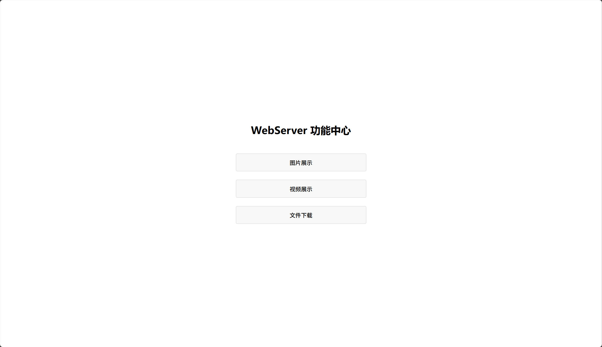

# TinyWebServer-C++11

基于 [qinguoyi/TinyWebServer](https://github.com/qinguoyi/TinyWebServer) 实现的现代化C++11风格Web服务器。

## 项目概述

本项目是对原TinyWebServer的重构版本，保留了原项目的核心功能和高性能特性，同时引入了C++11标准的现代编程理念和实践，使代码更加安全、简洁、易维护。

### 主要改动

1. **全面C++11化**：使用智能指针、lambda表达式、右值引用、default/delete函数等现代C++特性
2. **内存安全优化**：用`std::string`替代`char*`，减少内存泄漏风险
3. **并发模型改进**：线程池使用`std::thread`和`std::vector`，自动管理线程生命周期
4. **编译性能提升**：使用前置声明减少头文件依赖，加快编译速度
5. **代码结构优化**：更清晰的类职责划分和命名规范

## 技术架构

### 核心技术栈

- **C++11**：现代C++标准，提供更好的类型安全和内存管理
- **Linux网络编程**：基于epoll的高效事件处理机制
- **MySQL**：用户认证和数据存储
- **线程池**：半同步/半异步线程池模型
- **定时器**：处理非活动连接的超时机制
- **日志系统**：支持同步/异步日志记录

### 并发模型

支持两种并发模型：
- **Proactor模式**：主线程负责IO操作，工作线程负责业务逻辑
- **Reactor模式**：工作线程同时负责IO和业务逻辑

### 事件触发模式

支持多种epoll触发模式组合：
- LT(水平触发) + LT
- LT + ET(边缘触发)
- ET + LT
- ET + ET

## 环境依赖与编译指南

### 环境要求

- **操作系统**：Linux (Ubuntu 16.04+ 推荐)
- **编译器**：GCC 4.8+ (支持C++11)
- **数据库**：MySQL 5.7+
- **依赖库**：pthread, mysqlclient

### 依赖安装

```bash
sudo apt-get update
sudo apt-get install build-essential
sudo apt-get install libmysqlclient-dev
```

### 编译步骤

1. **配置数据库**：
   ```bash
   # 创建数据库
   mysql -u root -p -e "CREATE DATABASE tinyweb;"
   
   # 创建用户表
   mysql -u root -p tinyweb -e "CREATE TABLE user(username char(50) NULL, passwd char(50) NULL)ENGINE=InnoDB;"
   
   # 添加测试用户
   mysql -u root -p tinyweb -e "INSERT INTO user(username, passwd) VALUES('admin', '123456');"
   ```

2. **编译项目**：
   ```bash
   make
   ```

## 功能特性列表

### 基础功能

-  **HTTP协议支持**：完整支持HTTP/1.1协议，解析GET/POST请求
-  **静态资源服务**：支持图片、视频、HTML、CSS、JavaScript等静态文件

  **演示图片**：
  
  <div style="display: flex; flex-wrap: wrap; gap: 10px;">
    <div style="flex: 1; min-width: 200px; max-width: 300px;">
      
      <p style="text-align: center; margin: 5px 0 0 0;">首页</p>
    </div>
    <div style="flex: 1; min-width: 200px; max-width: 300px;">
      
      <p style="text-align: center; margin: 5px 0 0 0;">注册</p>
    </div>
    <div style="flex: 1; min-width: 200px; max-width: 300px;">
      
      <p style="text-align: center; margin: 5px 0 0 0;">登录</p>
    </div>
  </div>
  
  <div style="display: flex; flex-wrap: wrap; gap: 10px; margin-top: 10px;">
    <div style="flex: 1; min-width: 200px; max-width: 300px;">
      
      <p style="text-align: center; margin: 5px 0 0 0;">功能中心</p>
    </div>
    <div style="flex: 1; min-width: 200px; max-width: 300px;">
      
      <p style="text-align: center; margin: 5px 0 0 0;">图片展示</p>
    </div>
    <div style="flex: 1; min-width: 200px; max-width: 300px;">
      
      <p style="text-align: center; margin: 5px 0 0 0;">视频展示</p>
    </div>
  </div>
  
  <div style="display: flex; flex-wrap: wrap; gap: 10px; margin-top: 10px;">
    <div style="flex: 1; min-width: 200px; max-width: 300px;">
      
      <p style="text-align: center; margin: 5px 0 0 0;">下载中心</p>
    </div>
    <div style="flex: 1; min-width: 200px; max-width: 300px;">
      
      <p style="text-align: center; margin: 5px 0 0 0;">注册错误</p>
    </div>
    <div style="flex: 1; min-width: 200px; max-width: 300px;">
      
      <p style="text-align: center; margin: 5px 0 0 0;">登录错误</p>
    </div>
  </div>

-  **用户认证**：基于MySQL的用户注册和登录功能
-  **并发处理**：高性能线程池实现，支持上万并发连接
-  **超时管理**：定时器自动清理非活动连接
-  **日志记录**：可配置的同步/异步日志系统

### C++11特性体现

1. **智能指针**：`std::unique_ptr`用于资源管理，避免内存泄漏
   ```cpp
   std::unique_ptr<Utils> m_utils;
   ```

2. **Lambda表达式**：简化线程创建和回调函数
   ```cpp
   m_threads.emplace_back([this] { this->run(); });
   ```

3. **范围for循环**：更简洁的容器遍历

4. **自动类型推导**：`auto`关键字减少冗余代码

5. **默认/删除函数**：更精确地控制类的行为
   ```cpp
   ~http_conn() = default;
   http_conn(const http_conn &) = delete;
   http_conn &operator=(const http_conn &) = delete;
   ```

6. **常量表达式**：编译期计算，提高性能
   ```cpp
   static constexpr int READ_BUFFER_SIZE = 2048;
   ```

7. **初始化列表**：更安全、更简洁的初始化方式
   ```cpp
   int m_pipefd[2]{};
   char m_read_buf[READ_BUFFER_SIZE]{};
   ```

8. **右值引用**：优化资源传递，减少不必要的拷贝

9. **标准线程库**：`std::thread`替代pthread，跨平台兼容性更好

10. **条件变量**：`std::condition_variable`提供更安全的线程同步

## 使用方法

### 启动服务器

```bash
# 使用默认配置启动
./server

# 自定义端口启动
./server -p 8080

# 完整参数列表
./server -p port -l log_write -m trigmode -o linger -s sql_num -t thread_num -c close_log -a actor_model
```

### 访问服务器

- **首页**：`http://your_server_ip:9006`
- **注册**：`http://your_server_ip:9006/register.html`
- **登录**：`http://your_server_ip:9006/login.html`

### 配置选项

| 参数 | 描述 | 默认值 |
|------|------|--------|
| -p | 端口号 | 9006 |
| -l | 日志写入方式(0:同步, 1:异步) | 0 |
| -m | 触发模式组合 | 0 |
| -o | 优雅关闭连接(0:关闭, 1:开启) | 0 |
| -s | 数据库连接池数量 | 8 |
| -t | 线程池线程数量 | 8 |
| -c | 关闭日志(0:开启, 1:关闭) | 0 |
| -a | 并发模型(0:Proactor, 1:Reactor) | 0 |

## 核心代码结构

```
.
├── CGImysql/         # 数据库连接池实现
│   ├── sql_connection_pool.cpp
│   └── sql_connection_pool.h
├── http/            # HTTP请求处理
│   ├── http_conn.cpp
│   └── http_conn.h
├── lock/            # 线程同步机制
│   ├── locker.cpp
│   └── locker.h
├── log/             # 日志系统
│   ├── block_queue.h
│   ├── log.cpp
│   └── log.h
├── threadpool/      # 线程池
│   └── threadpool.h
├── timer/           # 定时器
│   ├── lst_timer.cpp
│   ├── lst_timer.h
│   ├── util.cpp
│   └── util.h
├── root/            # 网站根目录
│   ├── css/
│   ├── image/
│   ├── js/
│   ├── register.html
│   └── login.html
├── config.cpp       # 配置解析
├── config.h
├── main.cpp         # 程序入口
├── webserver.cpp    # 服务器核心逻辑
├── webserver.h
└── makefile         # 编译配置
```

### 核心类说明

1. **WebServer**：服务器核心类，管理各个模块的初始化和运行
   - `init()`：初始化服务器配置
   - `eventLoop()`：主事件循环
   - `thread_pool()`：初始化线程池
   - `sql_pool()`：初始化数据库连接池

2. **http_conn**：HTTP连接处理类，负责请求解析和响应构建
   - `process_read()`：解析HTTP请求
   - `process_write()`：构建HTTP响应
   - `process()`：处理完整的HTTP请求周期

3. **threadpool**：线程池类，管理工作线程和任务队列
   - `append()`：添加任务到队列
   - `run()`：工作线程执行函数

## 性能测试数据

### wrk 高并发性能分析

以下是在WSL (Ubuntu)环境中使用 `wrk -t12 -c1000 -d10s --latency` 工具进行的详细性能分析，配置为12线程和1000并发连接。

#### 一、 性能实验对照表 (核心指标)

|**实验阶段**|**变量控制 (Mode)**|**QPS (吞吐量)**|**50% Latency**|**99% Latency**|**关键发现**|
|---|---|---|---|---|---|
|**0. 初始态**|双 LT (-m 0) + 同步日志|**~3770**|1.72ms|566ms|基础水位，IO 阻塞明显|
|**1. 模式切**|**双 ET (-m 3)** + 同步日志|**~3302**|2.74ms|**1.19s**|**反直觉：** QPS 下降，长尾延迟翻倍。证明 ET 虽好，但被业务层同步阻塞拖累。|
|**2. 异步化**|双 ET (-m 3) + **异步日志**|**~3528**|2.16ms|**676ms**|**稳定性改善：** 99% 延迟几乎减半，但吞吐量仍被日志系统的“全局锁”卡死。|
|**3. 极限测**|双 ET (-m 3) + **关闭日志**|**22391**|**310us**|**398ms**|**性能跨越：** QPS 暴涨 6.3 倍，延迟进入微秒级。实锤日志是“头号杀手”。|

#### 二、 底层系统监控记录 (基于 vmstat 1)

在**Stage 3 (22,391 QPS)** 基准测试期间，内核表现出以下特征：

- **cs (Context Switch):** 峰值达到 **98,000 switches/second**
  - 分析：单队列线程池在处理1000并发连接时，线程切换开销显著

- **in (Interrupts):** 稳定在 **58,000 interrupts/second**
  - 分析：反映了高频网络I/O中断处理

- **CPU us (User):** 仅 **3%** 利用率
  - 分析：业务逻辑（HTTP解析/状态机）效率极高，不是性能瓶颈

- **CPU sy (System):** 约 **12%** 利用率
  - 分析：系统开销是业务开销的4倍，CPU主要被系统调用和同步锁占用

- **CPU id (Idle):** 剩余 **85%** 容量
  - 分析："集体围观现象 (Collective围观Phenomenon)"：由于全局任务队列锁，任务被序列化，尽管有可用容量，但CPU资源未充分利用

#### 三、 架构痛点总结

基于收集的数据，项目面临三个关键性能限制：

1. **日志瓶颈：** 同步I/O严重降低性能，而异步日志的"阻塞队列锁"限制了吞吐量上限

2. **锁竞争瓶颈：** vmstat显示的高`cs`（上下文切换）和低`us`（用户CPU）表明，在高并发下，单队列线程池频繁锁定导致线程睡眠/唤醒开销显著

3. **定时器瓶颈：** 持续的398ms 99%延迟和偶尔的超时表明，主线程对排序链表实现的O(n)遍历期间存在阻塞

#### 四、 优化方向

- **[数据结构]**：将定时器实现从**排序链表**替换为**最小堆 (std::priority_queue)**，以消除398ms的尾部延迟

- **[并发模型]**：实现**One Loop Per Thread**架构，将连接均匀分布在多个子Reactor上，以减少`cs`（上下文切换）并利用85%的空闲CPU容量，目标是QPS超过100,000

- **[日志组件]**：采用Muduo的**双缓冲**技术，避免每条日志的锁竞争，实现真正的无阻塞日志

## 贡献指南

欢迎提交Issue和Pull Request来帮助改进这个项目！

## 许可证

本项目采用MIT许可证，与原项目保持一致。

```
MIT License

Copyright (c) 2023 TinyWebServer-C++11

Permission is hereby granted, free of charge, to any person obtaining a copy
of this software and associated documentation files (the "Software"), to deal
in the Software without restriction, including without limitation the rights
to use, copy, modify, merge, publish, distribute, sublicense, and/or sell
copies of the Software, and to permit persons to whom the Software is
furnished to do so, subject to the following conditions:

The above copyright notice and this permission notice shall be included in all
copies or substantial portions of the Software.

THE SOFTWARE IS PROVIDED "AS IS", WITHOUT WARRANTY OF ANY KIND, EXPRESS OR
IMPLIED, INCLUDING BUT NOT LIMITED TO THE WARRANTIES OF MERCHANTABILITY,
FITNESS FOR A PARTICULAR PURPOSE AND NONINFRINGEMENT. IN NO EVENT SHALL THE
AUTHORS OR COPYRIGHT HOLDERS BE LIABLE FOR ANY CLAIM, DAMAGES OR OTHER
LIABILITY, WHETHER IN AN ACTION OF CONTRACT, TORT OR OTHERWISE, ARISING FROM,
OUT OF OR IN CONNECTION WITH THE SOFTWARE OR THE USE OR OTHER DEALINGS IN THE
SOFTWARE.
```

## 致谢

- 感谢原项目作者[qinguoyi](https://github.com/qinguoyi)创建了优秀的TinyWebServer
- 感谢所有为原项目和本项目做出贡献的开发者
